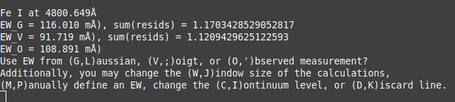

# GVOD
Planning on running abfind on MOOG? You're going to need to measure equivalent widths first!

This is a program capable of measuring these absorption lines by a number of different ways: just using the observed spectrum, fitting a Gaussian model, or fitting a Voigt model. Or you can make it do all three and decide for yourself which fits best.

### Setting Up GVOD
Firstly, you'll need to open Settings.py and modify it accordingly. In order, the parameters are as follows:

##### filename
The 1D spectrum file. A file for testing purposes has been provided.

##### wav, flx
The wavelength and flux data arrays. Depending on the format of your spectrum file, it may be necessary to add additional lines of code before the final assignment of wav and flx.

##### outfile
Set to the desired file path destination of final line list

##### object
An optional label which gets written to the first line of the final line list.


##### linelistname
The spectral line information file. The included test line list was queried from the [NIST database](https://physics.nist.gov/PhysRefData/ASD/lines_form.html)  and contains lines for Fe I, Fe II, C, N, O, and S.

##### method
The method by which the equivalent width is calculated
Valid arguments are:
- 'obs': Use the observed data
- 'gau': Fit a Gaussian profile to each line
- 'voi': Fit a Voigt profile to each line
- 'ask': Ask the user to choose from the above, among other settings

##### autoDiscard
Only used while method == 'ask', if set to true, rather than ask for user input, the program will simply discard measurements where the above differ by more than 20%

##### autoAccept
Only used while method == 'ask', if set to true, rather than ask for user input, the program will automatically accept all measurements where the above differ by less than 20%

##### FWHeight
Affects the width of the EW calculation window. Default is 0.5, range is (0,1).

##### mineqw
The minimum width which lines must reach to be added to the final list

##### MOOGformat
If true, the final line list will be immediately readable by MOOG, else it will be output as a csv


### Using GVOD
After verifying that your settings are correct, run ```python GVOD.py``` in terminal. Once GVOD has read the sprectrum and found the line features in it, it will display them to you as in the images shown here.


The plots overlay the fits to the observed spectrum as well as the observed spectrum itself. The right-most plot shows the range of the spectrum used in the equivalent width measurement, along with the surrounding area as a check against improper continuum detection.




The terminal prompts will ask you what you would like to do for the given spectral line, which is read in as one-character inputs. 
There are two input configurations, as follows:

- The common-sense input configuration, where each input is described by its first letter (```G```, ```V```, ```O``` for accepting a Gaussian, Voigt, or observed equivalent width measurement respectively, ```D``` to discard the line, ```W``` to modify the wavelength window of calculation, or ```C``` to change the defined continuum level)

- The compact input configuration, which keeps your left hand one place near the enter key (```L```, ```;```, ```'``` for accepting a Gaussian, Voigt, or observed equivalent width  measurement respectively, ```K``` to discard the line, ```J``` to modify the wavelength window of calculation, or ```I``` to change the defined continuum level)
